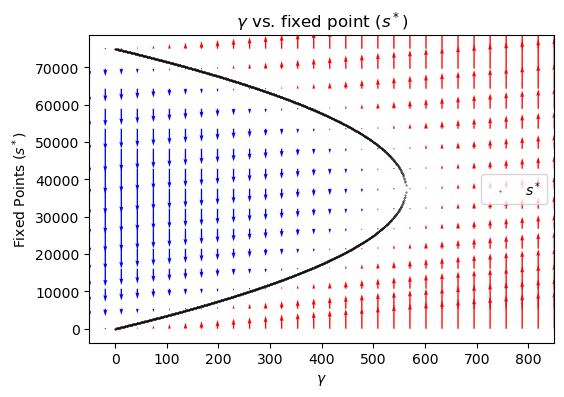
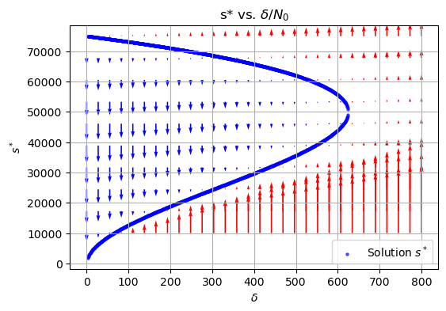

This repository is for project that reproduce the result and derive equitions of article: “Tipping Points of Space Debris in Low Earth Orbit” (doi:10.5334/ijc.1275) using Python

Quick Veiw:  
This article analyzes the behavior of a nonlinear system governing the quantity of space debris and its potential impact on space exploration. By establishing differential equations, the growth trend of space debris is examined. The study also explores the bifurcation phenomena and stability of the critical points of space debris quantity s under the influence of various external parameters. Furthermore, the modeling predicts the possible time frame for the occurrence of the Kessler Syndrome in the future.

Assumptions:  
The model in this paper constructs a nonlinear differential equation, where the annual increment of space debris is expressed as the first derivative of s with respect to t. One key assumption is that the collision frequency between particles is proportional to the square of the particle density in space. Additionally, the rates of debris being actively or passively removed and debris spontaneously generated due to events like explosions are both assumed to be proportional to the quantity of space debris. These factors are combined into a single parameter. Furthermore, it is assumed that future space launch missions will either approach a constant value or maintain equilibrium with the loss rate, allowing the input to be defined as a linear equation. When predicting the time for the occurrence of the Kessler Syndrome, it is defined as the point when the mathematical expectation of collisions caused by spacecraft launched within a year equals one.

Using Python to solve di<erential equation $\dot{s}=\alpha s^2+\beta s+\tau\left(s\right)$, the trends in space debris changes were obtained under di<erent inputs 𝛾 with 𝛽. Showing as below

  

Bifurcation Exploring:  

Similarly, by using Python to solve the critical points of the di<erential equation, the bifurcation phenomena of critical points under diferent parameters can be obtained.

 

In the figures above and below, the red arrows represent the increasing trend of debris, while the blue arrows indicate the decreasing trend. It can be observed that the initial conditions within the arc and in the lower part of the arc-covered region eventually converge to the stable point, whereas the upper part of the arc represents a divergent point.

 

By solving the integral of equation $t_k=\int_{s_0}^{s_k}\left(ds/dt\right)^{-1}\$ thinsp ds with different parameters, the two graphs above were obtained. These results are based on the assumption that the Kessler Syndrome occurs when s_k=1/\alpha, showing as below

 
